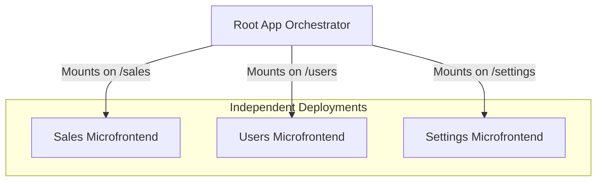

# Concepts

To work effectively with Vydra, it's essential to understand the core architectural concepts. The framework is designed around three main pillars that form the foundation of a scalable and maintainable frontend architecture:

1. **Microfrontends**
2. **Applications (Single-SPA)**
3. **Root Applications (Orchestrators)**

---

## Microfrontends

In Vydra, a **microfrontend** is a self-contained unit of functionality that can be developed and deployed independently. Each microfrontend serves its own bundle and is eventually consumed by a Root App.

This decentralized approach allows different teams to:
- Work independently without blocking each other.
- Deploy independently with isolated CI/CD pipelines.
- Use isolated dependencies, avoiding version conflicts.
- Scale applications horizontally across a large organization.

Because each microfrontend owns its own runtime and dependencies, teams can evolve applications without impacting the entire platform.

> [!WARNING]
> **Isolation is Key**
> Microfrontends should remain independent whenever possible. Avoid tightly coupling apps together through shared runtime state.

Vydra recommends that each microfrontend generates its own standalone bundle. The Root App only passes configuration to the microfrontend — it never injects dependencies or libraries into them unless explicitly desired. This ensures a clean separation of concerns.

```typescript
// Example of standard microfrontend lifecycles exposed by Vydra
export const lifecycles = {
  bootstrap,
  mount,
  unmount,
};
```

---

## Apps (Single-SPA)

A **Single-SPA application** in the context of Vydra behaves like a traditional standalone Single Page Application. It can run independently during development and testing, while also being prepared for orchestration inside a larger microfrontend ecosystem.

This flexibility provides multiple benefits:
- **Start small:** Develop a standalone app quickly.
- **Develop in isolation:** Teams can work without running the entire orchestrator locally.
- **Integrate later:** Easily plug the app into a Root App when ready.
- **Scale progressively:** Transition smoothly from a monolithic SPA to a microfrontend architecture.

```bash
# Start the app in standalone mode
vydra app serve
```

When running standalone, the application behaves like a normal SPA. When running under a Root App, the exact same application becomes a composable microfrontend.

> [!TIP]
> **Development Experience**
> Each application can be developed independently with Hot Module Replacement (HMR) and isolated environments, significantly speeding up the development cycle.

---

## Root App (Orchestrator)

The **Root App** acts as the orchestrator of the entire platform. Its primary responsibility is orchestration — not business logic.

Key responsibilities include:
- **Lifecycle Management:** Mounting and unmounting applications based on routes.
- **Global Layout:** Providing shared UI shells (e.g., sidebars, topbars).
- **Authentication:** Managing login state and protecting routes globally.
- **Shared Navigation:** Coordinating navigation between different microfrontends.

```typescript
// Registering a microfrontend in the Root App
registerApplication({
  name: "inventory",
  app: () => import("@apps/inventory"),
  activeWhen: ["/inventory"],
});
```

The Root App itself should remain as lightweight as possible. Avoid putting complex business rules inside the orchestrator.

---

## Architecture Overview



In this model:
- The Root App controls orchestration based on base URL paths.
- Each microfrontend owns its internal logic and routing.
- Teams can deploy independently.
- Applications remain completely isolated from one another.

This structure is especially effective in enterprise environments where multiple teams collaborate on the same platform.

---

## Routing Strategy

Vydra uses a **decentralized routing approach**.

Each microfrontend manages its own internal routes, while the Root App remains unaware of them. This allows microfrontends to have complex internal structures without complicating the root configuration.

```typescript
// Inside a microfrontend router
Router.register([
  {
    path: "/dashboard",
    componentTag: "sales-dashboard",
    componentLoader: () => import("./pages/dashboard"),
  },
]);
```

When a user navigates:
1. The **Root App** detects the URL change.
2. It identifies which microfrontend owns the base route (e.g., `/sales`).
3. The corresponding microfrontend is mounted.
4. **Internal routing** is delegated to that microfrontend, which resolves `/sales/dashboard`.

This process remains seamless and preserves the SPA experience for the end user.

> [!NOTE]
> **Routing Responsibility**
> The Root App should only care about basepaths. Internal nested routing belongs to each microfrontend.

---

## Shared Communication

Although applications remain isolated, they occasionally need to communicate. Vydra provides a lightweight **Event Bus** system for this purpose.

```typescript
import { Bus } from "@vydra-js/bus";

// Emitting an event from one microfrontend
Bus.emit("user:authenticated", user);

// Listening to the event in another microfrontend
Bus.on("user:authenticated", (user) => {
  console.log("User logged in:", user);
});
```

This event-driven approach enables:
- Cross-app communication
- Shared global notifications
- Authentication state synchronization
- Loose coupling between applications

---

## Why This Architecture?

Traditional monolithic frontends become increasingly difficult to maintain as teams and applications grow. Vydra addresses this by embracing:
- **Native browser standards** (Web Components)
- **Independent deployments**
- **Runtime isolation**
- **Distributed ownership**
- **Incremental scalability**

This architecture allows organizations to scale both technically and organizationally, ensuring a robust, maintainable platform for the long term.

---

Now that you understand the architecture, you're ready to start building.

[Next: Quick Start →](/guide/quick-start)
