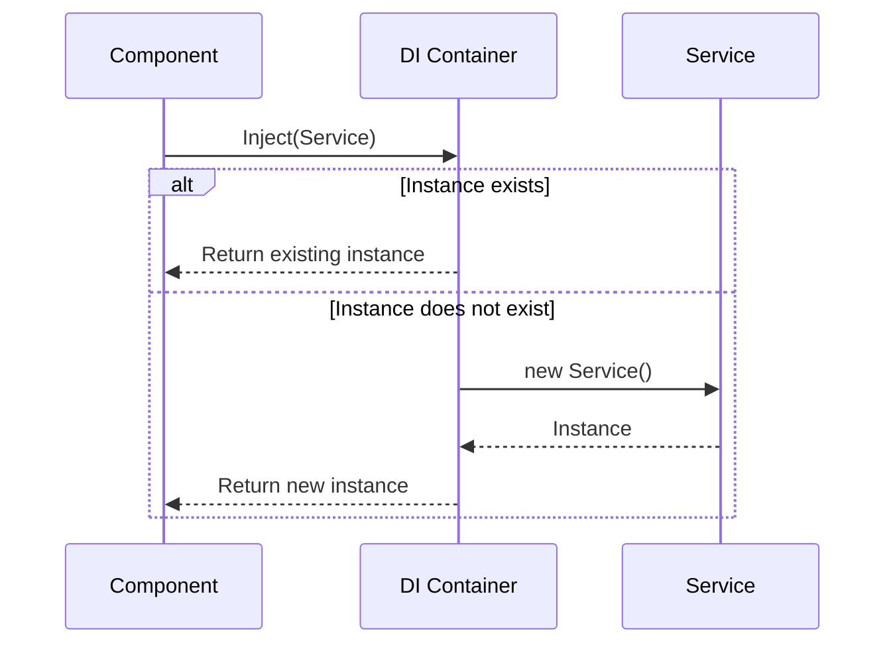

# Dependency Injection

Vydra provides a robust, lightweight **Dependency Injection (DI)** system using the `@Injectable` decorator and the `Inject` function.

This allows services, state managers, and utilities to be shared and injected across components and classes in a clean, scalable, and decoupled way.

---

## 1. Creating an Injectable Service

To register a class inside the DI container, simply decorate it with `@Injectable()`. This makes it available globally as a singleton instance by default.

```typescript
import { Injectable } from "@vydra-js/core";

@Injectable()
export class LoggerService {
  log(message: string) {
    console.log(`[Logger]: ${message}`);
  }
}
```

---

## 2. Injecting a Service

Use the `Inject()` function to resolve and inject a service instance into any class or Web Component.

```typescript
import { html, LitElement } from "lit";
import { ScopedElementsMixin } from "@open-wc/scoped-elements/lit-element.js";
import { Inject } from "@vydra-js/core";

// Assuming LoggerService is defined as above
import { LoggerService } from "./logger.service";

export class MyElement extends ScopedElementsMixin(LitElement) {
  // Inject the service into a private property
  private logger = Inject(LoggerService);

  connectedCallback() {
    super.connectedCallback();
    this.logger.log("MyElement connected to the DOM!");
  }

  render() {
    return html`<h1>Hello world</h1>`;
  }
}
```

---

## How It Works Under the Hood

The injection flow in Vydra is highly optimized:

1. **Registration:** When a class is marked with `@Injectable()`, Vydra registers the class metadata inside the global DI Container.
2. **Resolution:** When `Inject(ServiceClass)` is called, the container checks if an instance of `ServiceClass` already exists.
3. **Instantiation:** If it doesn't exist, it instantiates it. If it does, it returns the existing singleton.



---

## Recommended Use Cases

Dependency Injection is perfect for isolating business logic from UI components. 

### Shared State Management

```typescript
@Injectable()
export class AuthService {
  private user: User | null = null;

  isAuthenticated(): boolean {
    return this.user !== null;
  }
  
  setUser(user: User) {
    this.user = user;
  }
}
```

### API Services

```typescript
import { http } from "@vydra-js/http";

@Injectable()
export class ApiService {
  async getUsers() {
    return await http.get("/api/users");
  }
}
```

### Utility Services

```typescript
@Injectable()
export class StorageService {
  set(key: string, value: string) {
    localStorage.setItem(key, value);
  }
  
  get(key: string): string | null {
    return localStorage.getItem(key);
  }
}
```

---

## Best Practices

- **Keep Services Focused (SRP):** Each service should have a single responsibility. Don't create a monolithic "AppService". Use `AuthService`, `ThemeService`, `UserService`, etc.
- **Reuse Services:** Inject existing services into other services if needed. The DI container handles this gracefully.
- **Move Business Logic Out of Components:** Keep your Lit components focused strictly on rendering the UI and handling user events. Delegate complex logic to injected services.

> [!TIP]
> **Testing Advantage**
> Because your logic is decoupled into classes, you can easily unit test your services completely independent of the DOM or Lit environment.
