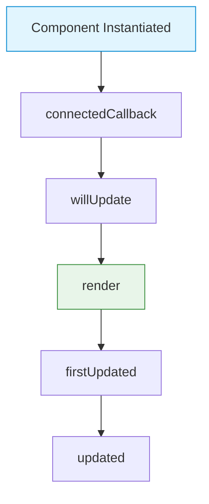

# Lifecycle

Lit components have a series of lifecycle methods that run when the component is created, updated, and removed. These hooks allow you to intercept the rendering process and manage side effects.

---

## 1. Native Element Lifecycles

Because Lit components are native Web Components, they inherit standard Custom Element lifecycle callbacks.

### `connectedCallback()`
Triggered when the component is inserted into the DOM. This is the ideal place to add global event listeners or initialize services.

```typescript
connectedCallback() {
  super.connectedCallback(); // Always call super!
  window.addEventListener("resize", this.handleResize);
}
```

### `disconnectedCallback()`
Triggered when the component is removed from the DOM. You **must** clean up global listeners here to prevent memory leaks.

```typescript
disconnectedCallback() {
  window.removeEventListener("resize", this.handleResize);
  super.disconnectedCallback(); // Always call super!
}
```

---

## 2. Lit Reactive Lifecycles

Lit introduces its own lifecycle methods to manage reactive updates efficiently.

### `willUpdate(changedProperties)`
Runs before the `render()` method. It allows you to compute values based on property changes *before* the DOM updates.

```typescript
willUpdate(changedProperties: Map<string | number | symbol, unknown>) {
  if (changedProperties.has("firstName") || changedProperties.has("lastName")) {
    this.fullName = `${this.firstName} ${this.lastName}`;
  }
}
```

### `firstUpdated()`
Runs exactly once, immediately after the component's first render. This is the best place to query the Shadow DOM and initialize third-party libraries (like charts or map instances) that require physical DOM nodes.

```typescript
firstUpdated() {
  const canvas = this.shadowRoot?.querySelector("canvas");
  this.chart = new Chart(canvas, { ... });
}
```

### `updated(changedProperties)`
Runs after every update (including the first one) once the DOM has been updated. Use this for DOM-dependent side effects.

```typescript
updated(changedProperties: Map<string | number | symbol, unknown>) {
  if (changedProperties.has("isOpen") && this.isOpen) {
    this.shadowRoot?.querySelector("input")?.focus();
  }
}
```

---

## 3. Advanced Control

### `shouldUpdate(changedProperties)`
Allows you to control whether the component should proceed with the update cycle. Returning `false` completely aborts the render.

```typescript
shouldUpdate(changedProperties: Map<string | number | symbol, unknown>) {
  // Only update if the count is an even number
  if (changedProperties.has("count")) {
    return this.count % 2 === 0;
  }
  return true;
}
```

---

## Visualizing the Flow

The typical lifecycle flow for a component:



---

## Good Practices

1. **Always Call `super`:** When overriding `connectedCallback` or `disconnectedCallback`, always call the `super` implementation to ensure Lit's internal mechanics function correctly.
2. **Cleanup in Disconnect:** If you create a timer (`setInterval`) or attach a listener to `window` or `document`, destroy it in `disconnectedCallback`.
3. **Keep `render` Pure:** The `render` method should strictly return HTML. Do not mutate state or query the DOM inside `render()`. Use `willUpdate` or `updated` instead.
